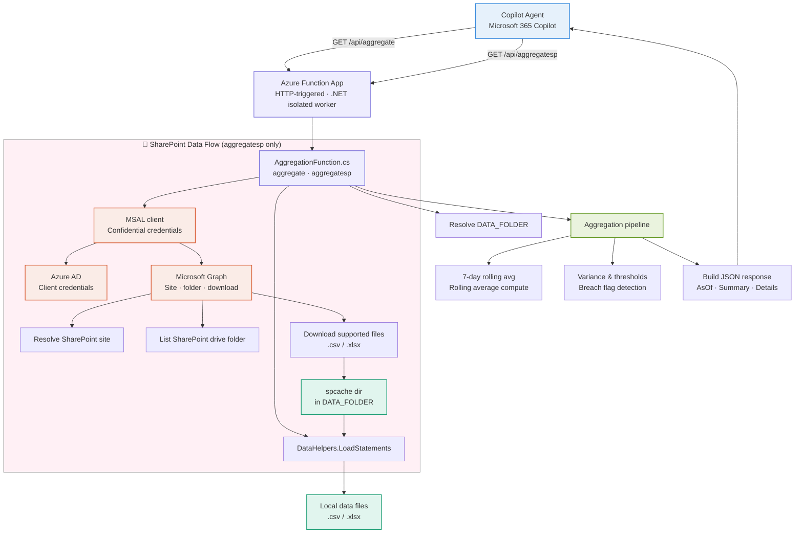

# 🏦 FinFlow — AI-Powered Treasury Aggregation Agent

> **Agent Academy Hackathon 2026** — Automated financial statement aggregation with breach detection, powered by Azure Functions and Microsoft 365 Copilot.

**Authors:** Radha Thatavarthi · Vinay Ayinapurapu

---

## 📌 Problem Statement

Treasury and finance teams routinely store daily financial statements (CSV/XLSX) across multiple SharePoint sites. Manually locating, downloading, and reconciling those files is slow and error-prone. There is also limited automated detection for balance breaches or unusual variance across business units and banks.

---

## 💡 Use Case

A lightweight, automated service that:

- Aggregates daily financial statements from local storage or SharePoint
- Computes 7-day rolling averages per Business Unit, Bank, and Currency
- Highlights variance and threshold breaches automatically
- Exposes results as clean JSON for dashboards, alerting, or Copilot agent consumption

---

## 🏗️ Architecture



### Data Flow Summary

| Step | Description |
|------|-------------|
| 1 | Copilot agent calls the Function App via HTTP |
| 2 | Function resolves `DATA_FOLDER` and loads statement rows from local files |
| 3 | For `aggregatesp`, files are fetched from SharePoint via Microsoft Graph and cached locally |
| 4 | Aggregation pipeline computes rolling averages, variance, thresholds, and breach flags |
| 5 | Function returns a JSON payload with `AsOf`, `Summary`, and `Details` |

---

## 🧩 Key Components

| File | Role |
|------|------|
| `FunctionApp/Program.cs` | Hosts the Azure Functions isolated worker process |
| `FunctionApp/AggregationFunction.cs` | Implements the `aggregate` and `aggregatesp` HTTP endpoints |
| `FunctionApp/Helpers.cs` | File loading, CSV/XLSX parsing, aggregation logic |
| `FunctionApp/Models.cs` | Request/response data models |
| `data/` | Local file storage (configurable via `DATA_FOLDER`) |

---

## ⚙️ Prerequisites

- [.NET 8 SDK](https://dotnet.microsoft.com/download/dotnet/8.0)
- [Azure Functions Core Tools](https://learn.microsoft.com/en-us/azure/azure-functions/functions-run-local)
- *(For `aggregatesp`)* An Azure AD app registration with client credentials and Microsoft Graph access

---

## 🚀 Quick Start (Local)

**1. Clone the repo and navigate to the function app:**

```powershell
cd FunctionApp
```

**2. Build and start the Functions host:**

```powershell
dotnet build
func start --dotnet-isolated
```

**3. Call the local endpoint:**

```powershell
# Local file aggregation
Invoke-RestMethod -Uri "http://localhost:7071/api/aggregate?asOf=2026-05-25&lookbackDays=7"

# SharePoint aggregation
Invoke-RestMethod -Uri "http://localhost:7071/api/aggregatesp?asOf=2026-05-25&lookbackDays=7"
```

---

## 🔐 Environment Variables

Configure these in `local.settings.json` for local development, or as **App Settings** when deployed to Azure.

| Variable | Required | Description |
|----------|----------|-------------|
| `DATA_FOLDER` | Optional | Local data folder path (defaults to `data/`) |
| `SP_CLIENT_ID` | `aggregatesp` only | Azure AD application client ID |
| `SP_TENANT_ID` | `aggregatesp` only | Azure AD tenant ID |
| `SP_CLIENT_SECRET` | `aggregatesp` only | Client secret for the Azure AD app |
| `SP_HOSTNAME` | `aggregatesp` only | SharePoint host e.g. `contoso.sharepoint.com` |
| `SP_SITE_PATH` | `aggregatesp` only | Site path e.g. `/sites/mysite` |
| `SP_FOLDER_PATH` | Optional | Path inside the drive to look for files |

**Example `local.settings.json`:**

```json
{
  "IsEncrypted": false,
  "Values": {
    "AzureWebJobsStorage": "UseDevelopmentStorage=true",
    "FUNCTIONS_WORKER_RUNTIME": "dotnet-isolated",
    "DATA_FOLDER": "data/",
    "SP_CLIENT_ID": "<your-client-id>",
    "SP_TENANT_ID": "<your-tenant-id>",
    "SP_CLIENT_SECRET": "<your-client-secret>",
    "SP_HOSTNAME": "contoso.sharepoint.com",
    "SP_SITE_PATH": "/sites/mysite",
    "SP_FOLDER_PATH": "/Shared Documents/Statements"
  }
}
```

---

## 📦 Deployment (Azure)

```powershell
# From the FunctionApp folder
dotnet publish -c Release
func azure functionapp publish <YOUR_FUNCTION_APP_NAME>
```

Set all required environment variables under **Configuration → Application Settings** in the Azure Portal.

---

## 🗺️ Roadmap

- [ ] Add a `local.settings.json` template and sample dataset for faster onboarding
- [ ] Add unit tests for `DataHelpers.LoadStatements` and aggregation logic
- [ ] Add optional alerting via email or Microsoft Teams on threshold breaches
- [ ] Extend Copilot agent with natural language querying over aggregated results

---

## 🤝 Contributing

Built for the **Agent Academy Hackathon 2026**. Pull requests and feedback welcome!

